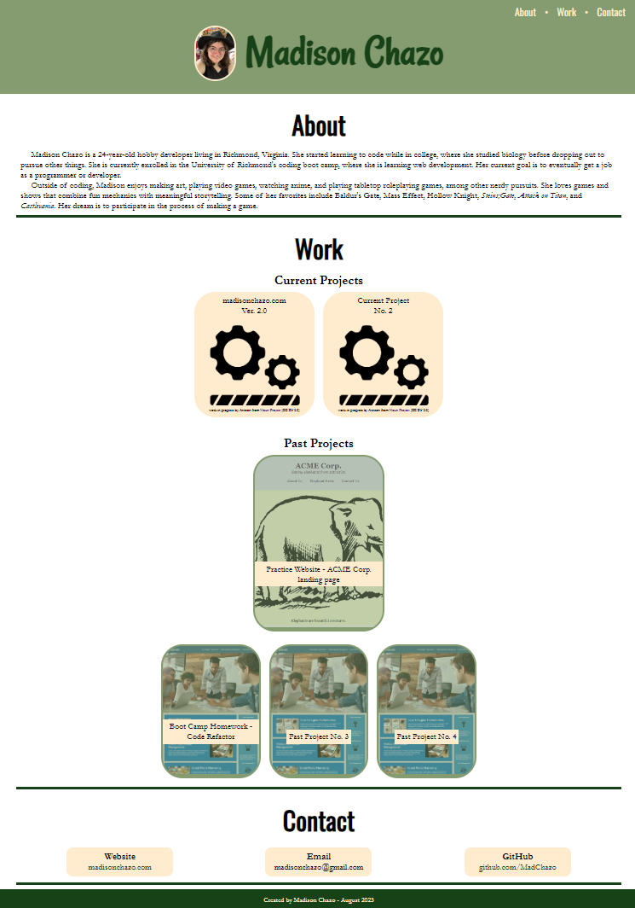

# Week 2 Homework - Portfolio

## Description

This website was created as a homework assignment for the University of Richmond Coding Boot Camp. The task was to create a portfolio to showcase the developer's work during the course. Currently, I've only done a few projects, so several of the projects listed are placeholders. While working on this assignment, I enjoyed being able to have complete creative control over the site and learned about the importance and difficulties involved in making sure a website is responsive to different screen sizes. 

## Installation

N/A

## Usage

Visit the website at https://madchazo.github.io/HW2-portfolio/.

## Credits

All of the code for this website was written by me.
The work in progress icon was created by Articon and sourced from the Noun Project under a CC BY 3.0 license. All other images are my own.

## License

See the LICENSE file in the repo.